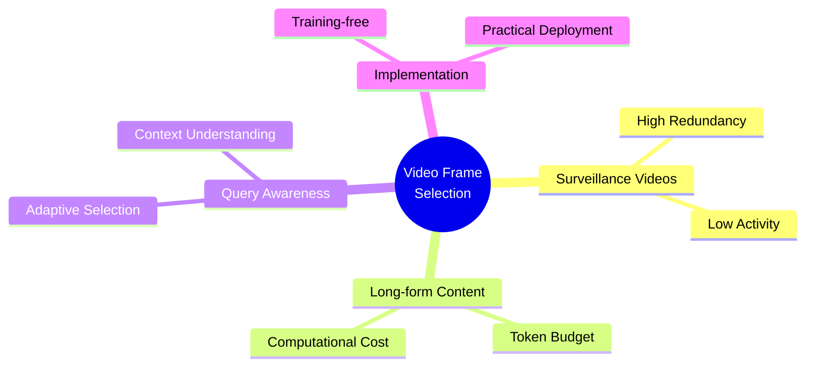

# 🎬 Video Frame Selection Papers

*A curated collection of cutting-edge research on efficient frame selection for long-form video understanding*

[Overview](#overview) • [Papers](#papers) • [Research Focus](#research-focus) • [Contributors](#contributors)

---

## Overview

This repository tracks state-of-the-art approaches to video frame selection, with emphasis on:
- 🎥 **Long-form video understanding** - Handling hour-long content efficiently
- 👁️ **Surveillance applications** - High redundancy, low-activity scenarios  
- 🤖 **MLLM optimization** - Managing token budgets in multimodal models
- ⚡ **Computational efficiency** - Practical, deployable solutions

---

## Papers

### 🔄 Reinforcement Learning

| Method | Paper | Venue | Links |
|--------|-------|-------|-------|
| **A.I.R** | Enabling Adaptive, Iterative, and Reasoning-based Frame Selection for Video Question Answering | ICLR 2026 (sub) | [📄 OpenReview](https://openreview.net/forum?id=SZVpOKw0YD) |
> *Effectively applying Vision-Language Models (VLMs) to VideoQA hinges on selecting a concise yet comprehensive set of frames*

---

### 🔧 Training-Free Methods

| Method | Paper | Venue | Links |
|--------|-------|-------|-------|
| **FOCUS** | Efficient Keyframe Selection for Long Video Understanding | ICLR 2026 (sub) | [📄 OpenReview](https://openreview.net/forum?id=1OQKqLFcbB) |
| **AKS** | Adaptive Keyframe Sampling for Long Video Understanding | CVPR 2025 | [📄 arXiv](https://arxiv.org/pdf/2502.21271v1) • [🏛️ CVF](https://openaccess.thecvf.com/content/CVPR2025/papers/Tang_Adaptive_Keyframe_Sampling_for_Long_Video_Understanding_CVPR_2025_paper.pdf) |
| **Q-Frame** | Query-aware Frame Selection | - | [📄 arXiv](https://arxiv.org/abs/2506.22139) |
| **DIG** | Divide, then Ground: Adapting Frame Selection to Query Types | - | [📄 arXiv](https://arxiv.org/abs/2512.04000) |
| **MDP3** | Training-free approach for List-wise Frame Selection | - | [📄 arXiv](https://arxiv.org/abs/2501.02885) |

<b>💡 Key Insight - FOCUS</b>

 
MLLMs represent images and video frames as visual tokens. Scaling from single images to hour-long videos inflates the token budget far beyond practical limits.

---

### 🎯 Supervised Learning

| Method | Paper | Links |
|--------|-------|-------|
| **Holistic Q-Aware** | Holistic Query-Aware Frame Selection | [📄 arXiv](https://arxiv.org/abs/2512.11534) |

---

### 📚 Additional Papers

> Papers pending categorization and detailed review

* https://arxiv.org/pdf/2507.00033v1
* https://arxiv.org/pdf/2506.01214v1
* https://arxiv.org/pdf/2506.00318v1
* https://arxiv.org/pdf/2505.24158v1
* https://arxiv.org/pdf/2504.17447v1
* https://arxiv.org/pdf/2410.03226v2

---

## Research Focus

**Core Challenges**
- ⚖️ **Efficiency vs. Coverage** - Selecting minimal frames without missing critical events
- 🎯 **Query Alignment** - Adapting selection to different question types
- 💰 **Token Economics** - Managing MLLM computational budgets
- 🔄 **Real-time Processing** - Practical deployment constraints

---

### 📌 Methodology Categories

`Reinforcement Learning` • `Training-Free` • `Supervised Learning`

*Emphasizing practical implementations with available code repositories*

⭐ Star this repo to stay updated with the latest research!

